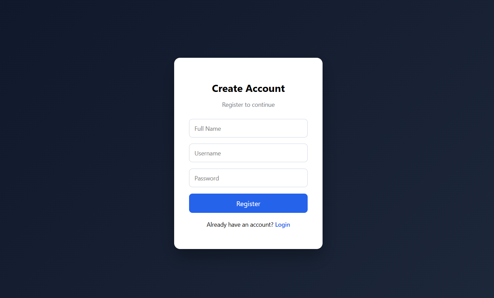
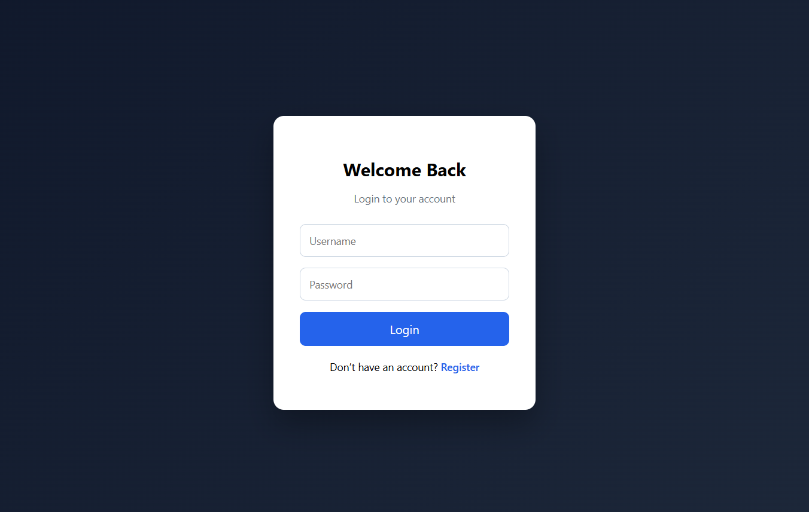
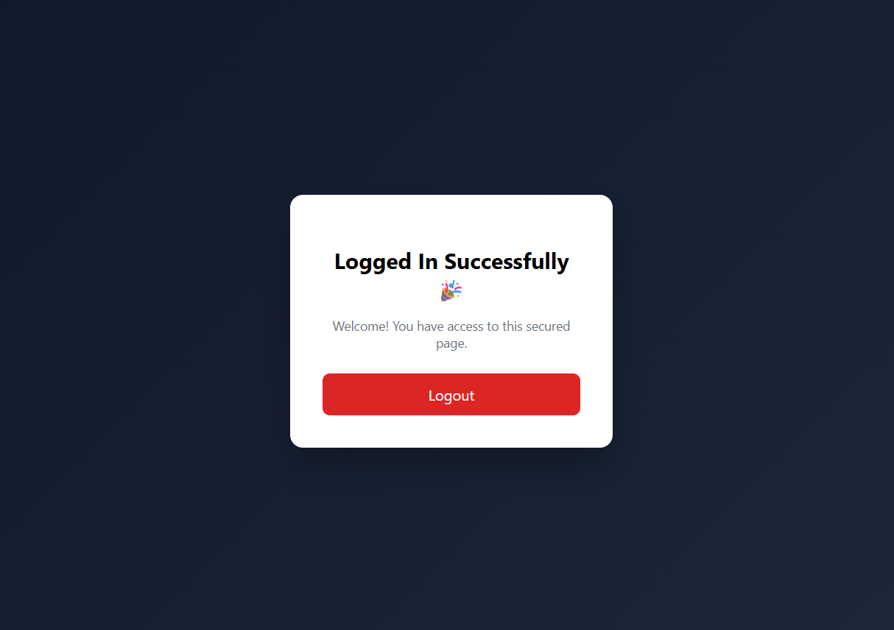

<!DOCTYPE html>
<html lang="en">
<head>
  <meta charset="UTF-8">
</head>
<body>

  <h1>Login Authentication</h1>

  

    The Login Authentication is a simple authentication system built
    using <strong>HTML</strong>, <strong>CSS</strong>, and <strong>JavaScript</strong>.
    The main objective of this project is to demonstrate the basic working of
    user authentication and secured page access.
  

  <h1>Project Description</h1>

  

    This project allows users to create an account by registering with their
    full name, username, and password. After successful registration, users
    can log in using their username and password to access a secured page.
  

  

    The application uses browser <strong>LocalStorage</strong> to store user
    credentials and manage login sessions. A consistent and clean user interface
    is maintained across the Login, Register, and Dashboard pages to improve
    user experience.
  

   
  <h1>Features</h1>

  <ul>
    <li>User registration with full name, username, and password</li>
    <li>Login using username and password</li>
    <li>Redirect to secured page after successful login</li>
    <li>Logout functionality</li>
    <li>Protected dashboard page</li>
    <li>Consistent design across all pages</li>
  </ul>

  <h1>Technologies Used</h1>

  <ul>
    <li><strong>HTML5</strong> – Structure of the web pages</li>
    <li><strong>CSS3</strong> – Styling and layout design</li>
    <li><strong>JavaScript</strong> – Authentication logic and interactivity</li>
    <li><strong>LocalStorage</strong> – Client-side data storage</li>
  </ul>

  <h1>Login Authentication</h1>

  

  

  

  

</body>
</html>
